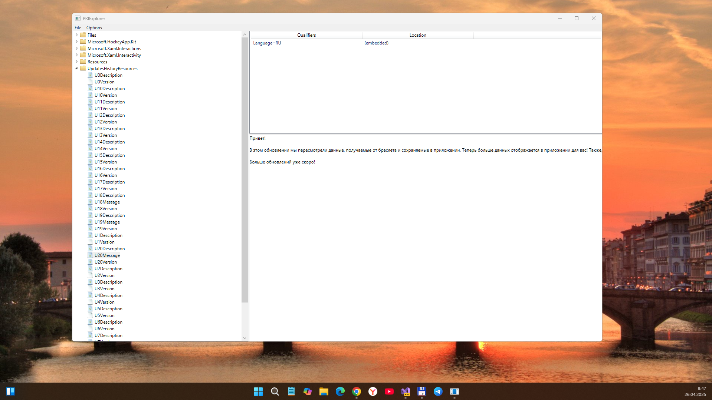

# PriTools

Tools for parsing and exploring PRI (Package Resource Index) files. I forked this repo mainly for PRIExplorer app.

## Screenshot

## PRIExplorer

This sample application allows to open and browse the contents of PRI files.
It is also possible to export individual resources.

The application leverages the [XbfAnalyzer](https://github.com/chausner/XbfAnalyzer)
(originally by [misenhower](https://github.com/misenhower/XbfAnalyzer))
to provide on-the-fly decompilation of XBF2 resources back to XAML.

## PriFormat

This project implements a PRI file reader in C# for low-level access to pretty much all structures in the PRI file format.
Only file reading, not writing, is supported at the moment.

## References
- https://github.com/chausner/PriTools
- https://github.com/chausner/XbfAnalyzer
- https://github.com/misenhower/XbfAnalyzer

## License

Apache 2.0, see LICENSE.

XBF2 decompilation code is originally based on the implementation by [misenhower](https://github.com/misenhower/XbfAnalyzer).

## ..
As is. No support. RnD only.

## .
[M][E] 2025
